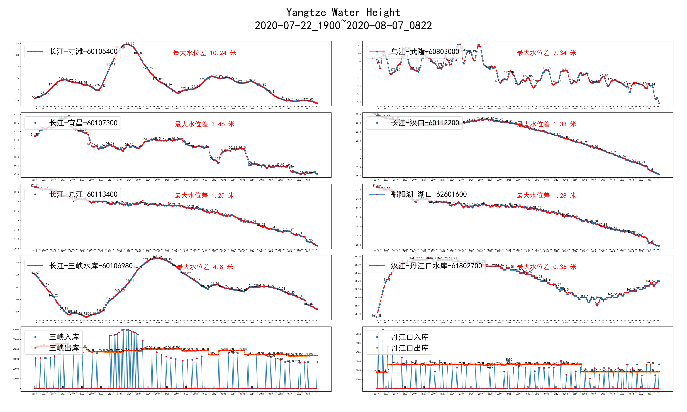

# 长江实时水情

长江水文网每小时发布实时水情，本程序采集重要水文站水情，绘制最近的水位图

本程序使用*MIT*协议，欢迎有资源的朋友部署到服务器，定时执行

## 运行

建议每半小时采集一次

* Windows用户`任务计划程序`执行`run.bat`
* Linux用户`crontab`执行`run.sh`

启动web服务脚本`web.[bat|sh]`

```python
python water.py [cmd]

class Command(Enum):
    redraw = 0  # 默认，总是重绘并打开水位图
    show = 1  # 有新的数据才重绘，总是打开水位图
    silent = 2  # 有新的数据才重绘，不打开水位图
```



## 链接

* [长江水文网](http://www.cjh.com.cn/)
* [水位iframe页](http://www.cjh.com.cn/sqindex.html)
